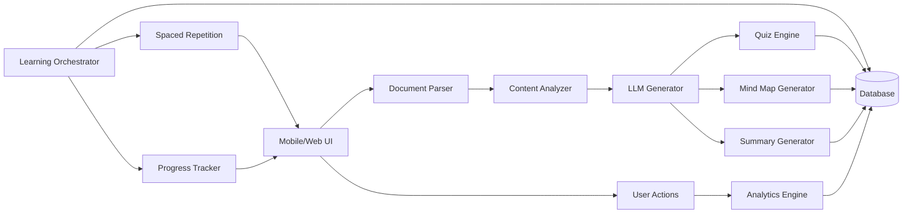

# DocuLearn
**Interactive Learning from Documents**


> Transform static PDFs, slides, and text into quizzes, mind maps, flashcards, and adaptive exercises — powered by AI.

---

## Table of Contents

1. [Overview](#overview)
2. [Goals](#goals)
3. [Architecture](#architecture)
4. [Core Components](#core-components)
5. [Workflow](#workflow)
6. [LLM Integration](#llm-integration)
7. [Example Use Case](#example-use-case)
8. [Technology Stack](#technology-stack)
9. [Future Extensions](#future-extensions)
10. [License](#license)

---

## Overview

DocuLearn takes educational documents (PDFs, PPTs, or plain text) and turns them into personalized, dynamic learning experiences. With the help of Large Language Models (LLMs), the app generates:

- **Quizzes** (MCQ, True/False, Fill-in-the-blank)
- **Mind Maps** (concept visualization)
- **Spaced Repetition Flashcards**
- **Summaries** (key concept extraction)

The content adapts to the user's learning style and pace.

---

## Goals

- **Automated Content Transformation**: From passive reading to active learning
- **Adaptive Learning**: Tailored difficulty based on user performance
- **Cross-Platform Support**: Web, Android, iOS
- **Gamification**: Badges, leaderboards, and progress tracking

---

## Architecture



---

## Core Components

### 1. Document Parser

Extracts text and structure from uploaded files:

- **PDF**: `PyPDF2` or `pdf.js`
- **DOCX**: `python-docx`
- **OCR**: Tesseract for scanned documents

```python
def parse_pdf(file):
    text = ""
    with open(file, "rb") as f:
        reader = PyPDF2.PdfReader(f)
        for page in reader.pages:
            text += page.extract_text()
    return text
```

### 2. Content Analyzer

- Identifies key concepts using NLP (spaCy, NLTK)
- Tags content by difficulty (basic/advanced)

### 3. LLM Generator

Uses prompts to create learning materials:

```python
def generate_quiz(text):
    prompt = f"""
    Generate 3 MCQs from this text: {text}
    Format: {{"question": "...", "options": ["...", ...], "answer": 0}}
    """
    return llm.generate(prompt)
```

### 4. Quiz Engine

- Validates LLM-generated questions
- Supports multimedia (images in quizzes)

### 5. Mind Map Generator

Creates interactive graphs with `D3.js` or `Miro API`

### 6. Spaced Repetition

Schedules reviews using the SM-2 algorithm

### 7. Progress Tracker

- Tracks correct/incorrect answers
- Recommends weak areas

---

## Workflow

1. **User Uploads a Document** (e.g., a biology PDF)
2. **System Extracts Text** and identifies sections (e.g., "Photosynthesis")
3. **LLM Generates Content**:
   - Quizzes: *"What is the role of chloroplasts?"*
   - Mind Map: `Photosynthesis → Light Reactions → Calvin Cycle`
4. **User Interacts** with quizzes/mind maps
5. **Analytics Update** the learning plan

---

## LLM Integration

### Prompt Template for Quizzes

```text
You are a teaching assistant. Create 3 MCQs from this text:

Text: "{text}"

Requirements:
- 1 correct answer, 3 plausible distractors
- Format as JSON with keys: "question", "options", "answer"
```

### Validation

- Check for duplicates
- Ensure answers are factually correct

---

## Example Use Case

### Input (Biology Textbook Excerpt)

"Photosynthesis occurs in chloroplasts, converting light energy into chemical energy."

### Output

1. **Quiz**:

```json
{
  "question": "Where does photosynthesis occur?",
  "options": ["Mitochondria", "Chloroplasts", "Nucleus", "Ribosomes"],
  "answer": 1
}
```

2. **Mind Map**:

```
Photosynthesis
├── Chloroplasts
└── Light Energy → Chemical Energy
```

---

## Technology Stack

| Component | Technologies |
|-----------|-------------|
| **Frontend** | Flutter (Mobile), React (Web) |
| **Backend** | Python (FastAPI), Firebase |
| **LLM** | OpenAI GPT-4, Claude, or Local LLMs |
| **Database** | Firestore/PostgreSQL |
| **Analytics** | Google Analytics, Mixpanel |

---

## Future Extensions

1. **Voice Interaction**: "Quiz me verbally on this document."
2. **Collaborative Learning**: Study groups with shared documents
3. **AR Mode**: Visualize mind maps in 3D space
4. **Personalized AI Tutor**: Chatbot for Q&A on documents

---

## License

This project is licensed under the MIT License - see the [LICENSE](LICENSE) file for details.
